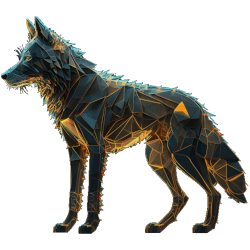

# lalaps
autofix security issues.

[![Version][badge-vers]][npm]
[![Bundle size][npm-size-badge]][npm-size-url]
[![Downloads][npm-downloads-badge]][npm]

[![CodeFactor][codefactor-badge]][codefactor-url]
[![SonarCloud][sonarcloud-badge]][sonarcloud-url]
[![Codacy][codacy-badge]][codacy-url]
[![Scrutinizer][scrutinizer-badge]][scrutinizer-url]

[![Dependencies][badge-deps]][npm]
[![Security][snyk-badge]][snyk-url]
[![Build Status][tests-badge]][tests-url]
[![Coverage Status][badge-coverage]][url-coverage]

[![Commit activity][commit-activity-badge]][github]
[![FOSSA][fossa-badge]][fossa-url]
[![License][badge-lic]][github]
[![Made in Ukraine][ukr-badge]][ukr-link]

## 🇺🇦 Help Ukraine
I woke up on my 26th birthday at 5 am from the blows of russian missiles. They attacked the city of Kyiv, where I live, as well as the cities in which my family and friends live. Now my country is a war zone. 

We fight for democratic values, freedom, for our future! Once again Ukrainians have to stand against evil, terror, against genocide. The outcome of this war will determine what path human history is taking from now on.

💛💙  Help Ukraine! We need your support! There are [dozen ways][ukr-link] to help us, just do it!

## Table of Contents
- [lalaps](#lalaps)
  - [🇺🇦 Help Ukraine](#-help-ukraine)
  - [Table of Contents](#table-of-contents)
  - [Requirements](#requirements)
  - [Installation](#installation)
  - [Usage](#usage)
    - [GitHub:](#github)
  - [Configuration](#configuration)
  - [Contribute](#contribute)

## Requirements
[![Platform Status][node-ver-test-badge]][node-ver-test-url]

To use library you need to have [node](https://nodejs.org) and [npm](https://www.npmjs.com) installed in your machine:

* node `>=10`
* npm `>=6`

Package is [continuously tested][node-ver-test-url] on darwin, linux and win32 platforms. All active and maintenance [LTS](https://nodejs.org/en/about/releases/) node releases are supported.

## Installation

To install the library run the following command

```bash
  npm i -g lalaps
```

## Usage

Run Web interface:
```bash
  node lib/web.js
```

Start the main worker:
```bash
node ./lib/bin/worker.js start
```

### GitHub: 
  1. analyze individual repository:

```bash
  node github.js analyze-repository <repository>
```

where `<repository>` is **full** GitHub repo name in form `{owner}/{name}`.

2. analyze all repositories
```bash
  node github.js start [<repositories>]
```

where `<repositories>` are `,` separated list of full names in form of `{owner}/{name}`.

## Configuration

For now, the configuration can be passed only using environment variables. A list of variables with default values can be found in the [.env.defaults](/.env.defaults) file.

## Contribute

Make the changes to the code and tests. Then commit to your branch. Be sure to follow the commit message conventions. Read [Contributing Guidelines](.github/CONTRIBUTING.md) for details.

[npm]: https://www.npmjs.com/package/lalaps
[github]: https://github.com/pustovitDmytro/lalaps
[coveralls]: https://coveralls.io/github/pustovitDmytro/lalaps?branch=master
[badge-deps]: https://img.shields.io/librariesio/release/npm/lalaps.svg
[badge-vers]: https://img.shields.io/npm/v/lalaps.svg
[badge-lic]: https://img.shields.io/github/license/pustovitDmytro/lalaps.svg
[badge-coverage]: https://coveralls.io/repos/github/pustovitDmytro/lalaps/badge.svg?branch=master
[url-coverage]: https://coveralls.io/github/pustovitDmytro/lalaps?branch=master

[snyk-badge]: https://snyk-widget.herokuapp.com/badge/npm/lalaps/badge.svg
[snyk-url]: https://snyk.io/advisor/npm-package/lalaps

[tests-badge]: https://img.shields.io/circleci/build/github/pustovitDmytro/lalaps
[tests-url]: https://app.circleci.com/pipelines/github/pustovitDmytro/lalaps

[codefactor-badge]: https://www.codefactor.io/repository/github/pustovitdmytro/lalaps/badge
[codefactor-url]: https://www.codefactor.io/repository/github/pustovitdmytro/lalaps

[commit-activity-badge]: https://img.shields.io/github/commit-activity/m/pustovitDmytro/lalaps

[scrutinizer-badge]: https://scrutinizer-ci.com/g/pustovitDmytro/lalaps/badges/quality-score.png?b=master
[scrutinizer-url]: https://scrutinizer-ci.com/g/pustovitDmytro/lalaps/?branch=master

[codacy-badge]: https://app.codacy.com/project/badge/Grade/2404d416834e4700961f4edb1c025b47
[codacy-url]: https://www.codacy.com/gh/pustovitDmytro/lalaps/dashboard?utm_source=github.com&amp;utm_medium=referral&amp;utm_content=pustovitDmytro/lalaps&amp;utm_campaign=Badge_Grade

[sonarcloud-badge]: https://sonarcloud.io/api/project_badges/measure?project=pustovitDmytro_lalaps&metric=alert_status
[sonarcloud-url]: https://sonarcloud.io/dashboard?id=pustovitDmytro_lalaps

[npm-downloads-badge]: https://img.shields.io/npm/dw/lalaps
[npm-size-badge]: https://img.shields.io/bundlephobia/min/lalaps
[npm-size-url]: https://bundlephobia.com/result?p=lalaps

[node-ver-test-badge]: https://github.com/pustovitDmytro/lalaps/actions/workflows/npt.yml/badge.svg?branch=master
[node-ver-test-url]: https://github.com/pustovitDmytro/lalaps/actions?query=workflow%3A%22Node.js+versions%22

[fossa-badge]: https://app.fossa.com/api/projects/custom%2B24828%2Flalaps.svg?type=shield
[fossa-url]: https://app.fossa.com/projects/custom%2B24828%2Flalaps?ref=badge_shield

[ukr-badge]: https://img.shields.io/badge/made_in-ukraine-ffd700.svg?labelColor=0057b7
[ukr-link]: https://war.ukraine.ua